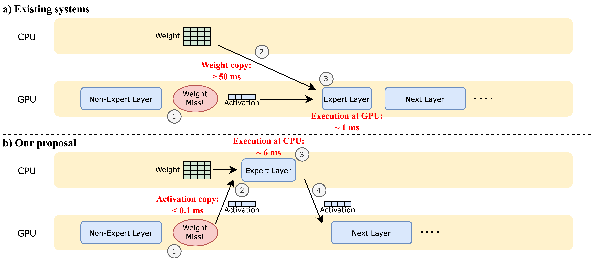
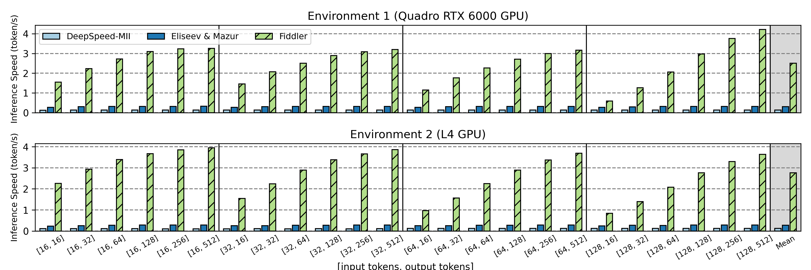

# 🎻 Fiddler: CPU-GPU Orchestration for Fast Local Inference of MoE Models [[paper]](https://arxiv.org/abs/2402.07033)

(This repository is a proof-of-concept and still under heavy construction)

Fiddler is a fast inference system for LLMs based on Mixture-of-Experts (MoE) architecture at local devices. It allows you to run **unquantized Mixtral-8x7B model (>90GB of parameters) with >3 token/s on a single 24GB GPU**.

## Update
- [2024/02] We published an [arxiv preprint](https://arxiv.org/abs/2402.07033)
- [2024/02] We released the repository.

## Usage
```bash
pip install -r requirements.txt
python src/fiddler/infer.py --model <path/to/mixtral/model> --input <prompt>
```

## Key Idea
Fiddler is an inference system to run MoE models larger than the GPU memory capacity in a local setting (i.e., latency-oriented, single batch).
The key idea behind Fiddler is to use the CPU’s computation power.



Existing offloading systems (e.g., [Eliseev & Mazur, 2023](https://github.com/dvmazur/mixtral-offloading)) primarily utilize the memory resources available on the CPU, while the computation mainly occurs on the GPU. The typical process involves: ① When some expert weights are missing from the GPU memory, ② they are copied from the CPU memory to the GPU memory, then ③ GPU executes the expert layer.
Although GPU execution is faster, the data movement introduces significant overhead. 

On the other hand, **Fiddler uses CPU computation resources in addition to memory resources**. The process is as follows: ① when some expert weights are missing on the GPU memory, ② we copy the activation values from the GPU memory to the CPU memory, instead of copying the weights. 
③ The computation of the expert layer then happens on the CPU, and ④ the output activation after the expert is copied back to the GPU.

This approach significantly reduces the latency of CPU-GPU communication, especially since the size of activations is considerably smaller than the weight size (`batch_size x 4096` versus `3 x 4096 x 14336` per expert for the Mixtral-8x7B) for a small batch size. Despite slower computation speeds on the CPU compared to the GPU, avoiding the weight copying process makes this approach more efficient. 

### Motivation
Why Fiddler is important? Because: 
- MoE models are showing promising performance. For instance, Mixtral-8x7B is the best open-source model at [LMSys Chatbot Arena](https://huggingface.co/spaces/lmsys/chatbot-arena-leaderboard) at the moment (2024/02)
- MoE models are sparse, meaning there are fewer computations per parameter. As a result, investing in more GPUs is less cost-effective (they have high computation power but small memory), especially for local inference purposes.
- MoE models can grow infinitely large, making it even more challenging to get enough GPUs. For instance, [Switch Transformer](https://arxiv.org/abs/2101.03961) has 2,048 experts per layer and >1T parameter in total.

Therefore, there is a huge benefit if we could efficiently run large MoE models with limited GPU resources.

For more technical details, please refer to our arxiv preprint.

## Benchmarks

We evaluate the performance of Fiddler in two environments: Quadro RTX 6000 GPU (24GB) + 48-core Intel Skylake CPU and L4 GPU (24GB) + 32-core Intel Cascade Lake CPU.
Here is the single batch latency (measured by token/s) compared against [DeepSpeed-MII](https://github.com/microsoft/DeepSpeed-MII) and [Mixtral offloading](https://github.com/dvmazur/mixtral-offloading) (Eliseev & Mazur, 2023):



Fiddler shows **an order of magnitude speedup** over existing methods.
Compared with DeepSpeed-MII and Mixtral offloading, Fiddler is on average faster by 19.4 and 8.2 times for Environment 1, and by 22.5 and 10.1 times for Environment 2.

## Roadmap
Fiddler is a research prototype and now only supports a 16-bit Mixtral-8x7B model.
We are working on supporting the following features.
- [ ] Support for other MoE models ([DeepSeek-MoE](https://github.com/deepseek-ai/DeepSeek-MoE), [OpenMoE](https://github.com/XueFuzhao/OpenMoE), [Switch Transformer](https://huggingface.co/docs/transformers/model_doc/switch_transformers), etc.)
- [ ] Support for quantized models
- [ ] Support for AVX512_BF16

## Known Limitations
Fiddler is currently relying on PyTorch implementation for expert processing at the CPU, and it is slow if your CPU does not support AVX512.

## Citation
If you use Fiddler in your research, please cite the following paper. 
```
@misc{kamahori2024fiddler,
      title={Fiddler: CPU-GPU Orchestration for Fast Inference of Mixture-of-Experts Models}, 
      author={Keisuke Kamahori and Yile Gu and Kan Zhu and Baris Kasikci},
      year={2024},
      eprint={2402.07033},
      archivePrefix={arXiv},
      primaryClass={cs.LG}
}
```
